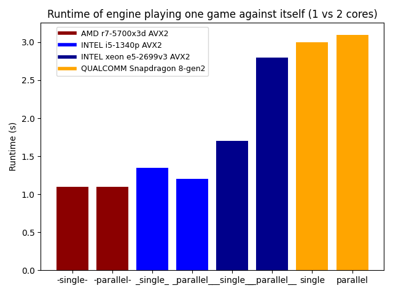

# Reversan Engine
Jako téma semestrální práce jsem si zvolil engine na stolní hru reversi. Reversan implementuje velmi efektivní implementace algoritmů na prohledávání herního stromu, díky čemuž je pro normálního člověka neporazitelný.

##### Krátké shrnutí použitých metod:
- Vlastní verze algoritmu negascout
- Alphabeta (neefektivní, pouze pro porovnání)
- Vlastní odladěné heuristické funkce
- Transpoziční tabulky pro memorizaci tahů
- Bitboards pro efektivní práci s herními deskami
- Vlastní AVX2 SIMD implementace pro maximální rychlost

Reversan dále disponuje příjemným terminálovým uživatelským prostředím, které podporuje několik barevných stylů.

## Kompilace
Program používá pouze standardní knihovny, jediný požadavek je podpora `C++20` (je potřeba kvůli funkci `std::popcount()`) a `64-bit` hardware. Kompilace by měla fungovat na všech platformách, byla však testována pouze na linuxu.

Program se kompiluje standardně přes `cmake`:
```bash
cmake -B build
cmake --build build
```
Měly by se vytvořit 2 soubory - `reversan_avx2` a `reversan_nosimd`. Jediný rozdíl je v (ne)použití AVX2 implementace kódu.

## Použití
Základní hru proti enginu můžete pustit program bez argumentů.
```bash
./reversan_avx2
```
- Tah se volí přes napsání souřadnic do terminálu. Engine automaticky kontroluje validitu zvoleného tahu.

Hloubku prohledávání herního stromu můžete určit s argumentem `-d`. V základu je nastavena na 10.
```bash
./reversan_avx2 -d 12
```
- Proheldávanou hloubkou můžete ovládat obtížnost bota.

Pokud chcete zkusit jiný styl terminálového prostředí, stačí použít argument `-s`.
```bash
./reversan_avx2 -s dracula
```
Program podporuje mnoho dalších zajímavých argumentů. Pro vypsání všech možných nastavení stačí napsat argument `-h`.
```bash
./reversan_avx2 -h
```
Pro dřívější ukončení stačí použít `ctrl-c`, program vrátí terminál do původního stavu a bezpečně skončí.

## Implementace
- Následující testy jsou prováděny na testovacím stavu `Board::States::Benchmark`.
#### Prohledávání stromu
Engine podporuje 2 algoritmy - minimax s alpha-beta prořezáváním a minimax s negascout prořezáváním. Oba algoritmy se ukazují jako masivní zlepšení oproti klasickému minimax v efektivitě prohledávání. Také se ukazuje, že negascout nemusí být vždy nutně rychlejší než alphabeta.

- Testovací stav je navržen tak, aby byl pro prořezávání komplikovaný. Obecně je ale negascout mnohem lepší volba.

#### Transpoziční tabulky
Transpoziční tabulky slouží k memorizaci již prohledaných stavů, což dále snižuje počet prohledaných stavů.


#### Optimalizované pořadí prohledávání tahů
Optimální pořadí prohledávání tahů je důležité pro efektivní prořezávání herního stromu, to platí hlavně pro negascout. Základní pořadí jde řádek po řádku z levého horního rohu do pravého dolního, optimalizované pořadí je založené na samotné heuristické evaluační funkci.


#### Heuristická funkce
Jelikož není možné prohledávat herní strom až do konce, musíme estimovat kvalitu stavů pomocí heuristické funkce. Pro evaluaci se používá heuristická mapa, která přiřadí každému poli určitou váhu. Dále se bere v potaz počet možných tahů, což se ukázalo jako dobrý indikátor kvality stavu.


## Strategie optimalizace
Většina výpočetního času je ztrávena nad funkcemi manipulujícími s herní deskou - hledání validních tahů, zahrání daného tahu a výpočet kvality desky na základe heuristické funkce - efektivní implementace těchto algoritmů je podstatná.
- Všechna měření na platformě `Debian 12`, kompilováno s `gcc 12.2.0`.

#### Bitboards
Hra reversi se hraje na 8x8 desce, což je možné dobře využít. Celý stav můžeme reprezentovat pouze pomocí 2 promněných `uint64_t` - jedna pro bílou a druhá pro černou.

Hlavní výhodou je, že tato datová struktura nám umožní chytře používat bitové operace, což je mnohem rychlejší než pracovat nad polem.

Další výhodou je malá paměťová náročnost, každá deska zabere pouze `128bitů`. Pomocí `Mamur3` hashingu jde snadno vytvořit `64bit` hash, který se následně používá v transpozičních tabulkách.

#### AVX2 SIMD instrukce
Všechny funkce pro manipulaci s deskou mají i druhou speciální implementaci, která výrazně program zrychluje na podporovaném hardwaru. Každý nový `x86` procesor *(posledních +-10 let)* tyto instrukce podporuje.

Jedinou nevýhodou je značně komplikovanější kód.

- U všech procesorů výrazně `AVX2` instrukce pomáhají.
- Zajímavé je, že největší nárust je na `xeon e5-2699v3`, který je založený na první architektuře s podporou těchto instrukcí.
- Také je zajímavé, že v kategorii NOSIMD je nejrychlejší `snapdragon 8 gen 2`, což je low power `arm` čip pro mobily *(testováno přes TERMUX s CLANG na Samsung Z Fold 5)*.

#### Paralelizace negascout
Paralizace algoritmu negascout je velmi komplikovaný úkol. Negascout je v základu čistě sekvenční algoritmus, kde jakákoliv paralelizace může velmi negativně ovlivnit prořezávání stromu.

První tah je prohledán sekvenčně pro odhad hodnot alpha a beta. Zbytek je následně prohledáván paralelně.

Jsou implementovány následující strategie pro minimalizaci overheadu:
- Threadpool implementovaný třídou `ThreadManager` zajišťující minimální overhead při alokaci nové práce.
- Efektivní paralelní verze transpozičních tabulek.
- Dynamická aktualizace alpha beta hodnot mezi vlákny.

I přes tyto všechny metody není implementace moc efektivní, jelikož se výrazně zvyšuje počet prohledaných stavů. Paralelní implementace se neškáluje přes 2 jádra.

- Znatelné zrychlení je pouze na `i5-1340p`. Z měřených procesorů má nejpokročilejší architekturu, díky čemuž je pravděpodobně vidět **10%** zrychlení.
- Na procesorech `r7-5700x3d` a `snapdragon 8-gen2` je výsledek téměř identický.
- Na procesoru `xeon e5-2699v3` dochází k velkému zhoršení. Jedná se už o starší procesor *(2014)* s jednodušší architekturou, která není v paralelizace tak efektivní.